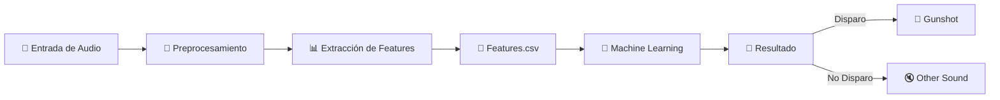

# Sistema Inteligente de Detección de Disparos mediante Análisis Acústico con Machine Learning

## Descripción del Proyecto

El presente proyecto tiene como finalidad desarrollar un sistema inteligente capaz de detectar sonidos de disparos mediante análisis acústico y técnicas de Machine Learning.

El sistema analizará archivos de audio para clasificarlos en dos categorías:

* Disparos
* No disparos

El proyecto integra conceptos de:

* Inteligencia Artificial
* Procesamiento Digital de Señales
* Machine Learning
* Ciencia de Datos
* Ingeniería de Software
* Automatización de pruebas

La solución utiliza procesamiento acústico, extracción de características y modelos de clasificación para identificar eventos sonoros asociados a disparos en distintos entornos.

---
# Objetivo

Desarrollar un modelo de clasificación de audio capaz de identificar disparos en grabaciones acústicas mediante técnicas de Machine Learning y procesamiento digital de señales.

---


# Tecnologías Utilizadas

## Lenguaje Principal

* Python

## Librerías

* Librosa
* NumPy
* Matplotlib
* Scikit-learn
* Pandas
* SoundFile

## Herramientas

* Git
* GitHub
* Visual Studio Code
* Jira

---

# Arquitectura del Proyecto

```plaintext
DeteccionDeDisparos/
│
├── data/
│   ├── raw/
│   └── processed/
│
├── docs/
│   └── documentación técnica
│
├── notebooks/
│   └── experimentación y análisis
│
├── reports/
│   └── reportes y resultados
│
├── src/
│   ├── data/
│   │   ├── load_data.py
│   │   └── preprocess.py
│   │
│   ├── features/
│   │   └── visualization.py
│   │
│   ├── models/
│   └── utils/
│
├── tests/
│   └── pruebas automatizadas
│
├── main.py
├── requirements.txt
└── README.md

```

---


# Pipeline del Sistema

---
# Procesamiento de Audio

El sistema realiza diferentes etapas de procesamiento acústico:

* Lectura de archivos WAV
* Conversión mono
* Estandarización de sample rate
* Normalización de amplitud
* Ajuste automático de duración
* Padding y trimming
* Extracción de MFCC
* Generación de espectrogramas

## Features Acústicas Utilizadas

| Feature | Descripción |
|---|---|
| MFCC | Representación espectral basada en percepción humana |
| Spectral Centroid | Centro de masa del espectro |
| Zero Crossing Rate | Cambios de signo en la señal |
| Chroma | Representación armónica |
| RMS Energy | Energía promedio del audio |

---

# PCA / t-SNE de Audios

Se implementó una visualización mediante reducción de dimensionalidad usando PCA y t-SNE para analizar el comportamiento acústico de distintas clases de audio.

## Clases Representadas

| Clase | Color |
|---|---|
| Disparos | Rojo |
| Ruido ambiente | Azul |
| Vehículos | Verde |
| Voces humanas | Amarillo |
| Sirenas | Morado |

Estas técnicas permiten visualizar cómo los sonidos se agrupan acústicamente en clusters diferenciados.

---

# Machine Learning

El sistema utiliza técnicas de Machine Learning para clasificar eventos acústicos.

## Modelos Evaluados
* Random Forest
* SVM
* XGBoost
* Redes Neuronales

## Métricas de Evaluación

| Métrica | Objetivo |
|---|---|
| Accuracy | 90% |
| Precision | 89% |
| Recall | 91% |
| F1-Score | 90% |

---

# Pruebas Automatizadas

El proyecto incorpora pruebas automatizadas para validar el correcto funcionamiento del sistema.

## Scripts de Prueba

| Script | Objetivo |
|---|---|
| test_audio_types.py | Validación de formatos de audio |
| test_audio_not_empty.py | Verificación de audios válidos |
| test_waveform.py | Validación de waveforms |
| load_data.py | Verificación de carga de datasets |

## Objetivos de las Pruebas
* Garantizar integridad de datos
* Validar procesamiento acústico
* Detectar errores tempranos
* Automatizar verificaciones del sistema

---


# Funcionalidades Implementadas

## Carga de Dataset

* Lectura automática de audios
* Clasificación automática por carpetas
* Soporte para múltiples formatos de audio
* Validación básica de errores

## Carga Uniforme de Audio

* Conversión de audios a mono
* Estandarización de sample rate
* Ajuste automático de duración
* Padding y trimming automático

## Visualización de Waveforms

* Representación gráfica de señales acústicas
* Visualización por clases
* Comparación entre disparos y no disparos

---

# Estado Actual del Proyecto

## COMPLETADO 

* Estructura del proyecto
* Carga de datasets
* Normalización de audios
* Waveforms
* Extracción inicial de features
* Validación de datos
* Visualizaciones acústicas
* Configuración Git/GitHub
* Pruebas automatizadas

## EN DESARROLLO 

* Entrenamiento del modelo
* Evaluación de métricas
* Split Train/Test
* Optimización del pipeline

## FUTURO 

* Streamlit / FastAPI
* Predicción en tiempo real
* Despliegue en la nube
* Optimización avanzada del modelo
* Monitoreo online

---

# Roles del Equipo

| Rol                                   | Integrante | GitHub       |
| ------------------------------------- | ---------- | ------------ |
| Líder de Machine Learning             | Leonardo   | Levanxx      |
| Responsable de Datos (Dataset)        | Jesus      | Yumecry      |
| Responsable de Documentación Técnica  | Xiomara    | Xiomara306V  |
| Desarrollador de Interfaz / Prototipo | Miguel     | mofuel       |
| Responsable de Pruebas e Integración  | Jhoan      | JhoanAronith |

---

# Metodología

El proyecto sigue una metodología basada en:

* CRISP-DM
* Scrum
* desarrollo iterativo incremental
## Etapas CRISP-DM

1. Comprensión del negocio
2. Comprensión de datos
3. Preparación de datos
4. Modelado
5. Evaluación
6. Despliegue
---

# Instalación

## Clonar repositorio

```bash
git clone https://github.com/Levanxx/DeteccionDeDisparos.git
```

## Crear entorno virtual

### Windows

```bash
python -m venv venv
venv\Scripts\activate
```

### macOS

```bash
python3 -m venv venv
source venv/bin/activate
```

## Instalar dependencias

```bash
pip install -r requirements.txt
```

---

# Ejecución

```bash
python main.py
```

En macOS:

```bash
python3 main.py
```

---

# Dataset

* UrbanSound8K
* Gunshot Audio Dataset
* Firearms Audio Dataset – 58 Gun Types
* Gunshot/Gunfire Audio Dataset

## Organización

```plaintext
data/raw/disparos/
data/raw/no_disparos/
```

---

# Próximas Implementaciones

* Integración con Streamlit
* APIs con FastAPI
* Predicción en tiempo real
* Despliegue cloud
* CNN para audio
* Detección multi-evento
* Monitoreo acústico inteligente
