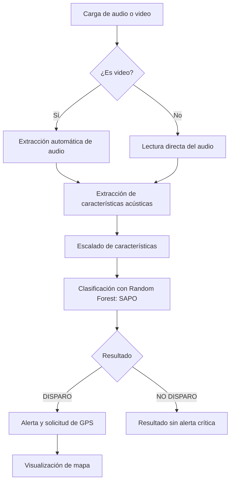

# SAPO AI

**Sistema Acústico de Protección y Observación**

SAPO AI es una aplicación de inteligencia artificial para clasificación acústica de disparos. El sistema acepta archivos de audio y video; cuando la entrada es un video, extrae automáticamente la pista de audio y aplica un modelo de clasificación basado en **Random Forest** para determinar si el contenido corresponde a **DISPARO** o **NO DISPARO**.

Cuando SAPO AI detecta un disparo, la aplicación muestra una alerta y solicita acceso a la ubicación GPS del dispositivo para visualizar un mapa aproximado del punto de detección.

## Objetivo del Sistema

Desarrollar un sistema de apoyo para la detección acústica de eventos asociados a disparos mediante técnicas de procesamiento digital de señales y aprendizaje automático. SAPO AI busca transformar archivos multimedia en evidencia acústica procesable, entregando una clasificación clara y una respuesta visual inmediata ante eventos críticos.

## Problema que Resuelve

La identificación manual de sonidos de disparos en grabaciones de audio o video puede ser lenta, subjetiva y difícil de escalar. SAPO AI automatiza este proceso mediante extracción de características acústicas y clasificación binaria, reduciendo el tiempo de análisis y facilitando la generación de alertas georreferenciadas cuando se detecta un posible disparo.

## Tecnologías Utilizadas

- **Python** como lenguaje principal.
- **Streamlit** para la interfaz web interactiva.
- **Librosa** para carga, procesamiento y extracción de características de audio.
- **MoviePy** para extracción de audio desde archivos de video.
- **NumPy** y **Pandas** para manejo numérico y tabular.
- **Scikit-learn** para escalado, entrenamiento y evaluación del modelo.
- **Joblib** para serialización de modelos y escaladores.
- **Folium / Leaflet / OpenStreetMap** para visualización geoespacial.
- **Pytest** para pruebas automatizadas.

## Modelo Principal

El modelo actual del proyecto se denomina **SAPO**. Es un clasificador Random Forest entrenado sobre características acústicas extraídas de audios etiquetados como `disparos` y `no_disparos`.

El modelo anterior se denomina **Sapito** y se conserva en el repositorio como versión previa del sistema:

- `models/sapo.pkl`
- `models/sapo_scaler.pkl`
- `models/sapito.pkl`
- `models/sapito_scaler.pkl`

## Métricas del Modelo Actual

SAPO alcanza un rendimiento aproximado de **97% de accuracy** en la evaluación disponible. El modelo limpio fue entrenado evitando data leakage: el escalador se ajusta únicamente con datos de entrenamiento y luego transforma los datos de prueba.

Resultados reportados:

| Métrica | Valor |
|---|---:|
| Accuracy | 96.89% |
| Precision | 95.77% |
| Recall | 97.63% |
| F1-Score | 96.69% |

Revisión de overfitting:

| Indicador | Valor |
|---|---:|
| Train Accuracy | 99.89% |
| Test Accuracy | 96.89% |
| Diferencia | 3% |
| Cross Validation media | 97.15% |

**Conclusión:** no se observa overfitting fuerte.

## Pipeline de Clasificación



Etapas principales:

1. Carga de archivo de audio o video.
2. Extracción de audio si el archivo es video.
3. Extracción de características acústicas.
4. Escalado de características.
5. Clasificación con Random Forest.
6. Resultado binario: **DISPARO** o **NO DISPARO**.
7. Alerta y visualización GPS si se detecta disparo.

## Formatos Soportados

La aplicación Streamlit soporta:

- WAV
- MP3
- MP4
- MOV
- AVI

## Estructura del Repositorio

```text
DeteccionDeDisparos/
├── data/
│   ├── raw/                 # Dataset original, no versionado completamente
│   ├── processed/           # Audios procesados y features generadas
│   └── videos IA/           # Material de video local
├── docs/                    # Documentación técnica de SAPO AI
├── models/                  # Modelos y escaladores serializados
├── notebooks/               # Espacio para experimentación
├── reports/                 # Reportes del proyecto
├── src/
│   ├── app/                 # Aplicación Streamlit y predicción
│   ├── data/                # Carga, validación y preparación de datos
│   ├── features/            # Extracción y visualización de características
│   ├── models/              # Entrenamiento, evaluación y comparación
│   └── preprocessing/       # Guardado de audio procesado
├── tests/                   # Pruebas automatizadas
├── main.py                  # Generación de features desde el dataset
├── requirements.txt
└── README.md
```

## Instalación del Entorno

Desde la raíz del proyecto:

```bash
python3 -m venv venv
source venv/bin/activate
pip install -r requirements.txt
```

En Windows:

```bash
python -m venv venv
venv\Scripts\activate
pip install -r requirements.txt
```

## Ejecución de la Aplicación

```bash
streamlit run src/app/streamlit_app.py
```

Luego, subir un archivo WAV, MP3, MP4, MOV o AVI y presionar **Analizar con SAPO**.

## Entrenamiento y Evaluación

Generar características acústicas:

```bash
python main.py
```

Entrenar el modelo limpio, evitando data leakage:

```bash
python src/models/train_random_forest_clean.py
```

Evaluar overfitting:

```bash
python src/models/check_overfitting.py
```

## Clasificación vs Predicción

En SAPO AI, **clasificación** es la tarea de asignar una entrada acústica a una clase definida: `DISPARO` o `NO DISPARO`. **Predicción** es el acto concreto de aplicar el modelo entrenado sobre un archivo nuevo para obtener una de esas clases. Por ello, el sistema realiza predicciones individuales dentro de un problema de clasificación binaria.

## Uso de la Aplicación

1. Activar el entorno virtual.
2. Ejecutar Streamlit.
3. Cargar un archivo de audio o video.
4. Revisar la vista previa del archivo.
5. Presionar **Analizar con SAPO**.
6. Interpretar el resultado:
   - **DISPARO:** se muestra alerta y solicitud de ubicación GPS.
   - **NO DISPARO:** se informa que no se detectó disparo.

## Limitaciones Actuales

- El sistema depende de la calidad, duración y representatividad del dataset acústico.
- La app clasifica el audio extraído de videos, pero todavía no analiza la imagen del video.
- El mapa depende de permisos de ubicación del navegador y de servicios externos de mapas.
- Los resultados no deben interpretarse como evidencia forense concluyente sin validación adicional.
- El rendimiento puede variar frente a ruido extremo, ecos, grabaciones saturadas o dispositivos de baja calidad.

## Mejoras Futuras

- **SAPO Vision:** análisis visual del contenido de video.
- **SAPO Fusion:** integración de señales acústicas y visuales.
- Historial de detecciones y trazabilidad por fecha, archivo y ubicación.
- Mejor integración de mapas y persistencia geoespacial.
- Despliegue web con control de usuarios.
- Evaluación con datasets más amplios y escenarios reales.

## Documentación Técnica

La documentación completa está organizada en:

- [docs/overview.md](docs/overview.md)
- [docs/pipeline.md](docs/pipeline.md)
- [docs/model.md](docs/model.md)
- [docs/usage.md](docs/usage.md)
- [docs/evaluation.md](docs/evaluation.md)

## Autor

**Levanx**
