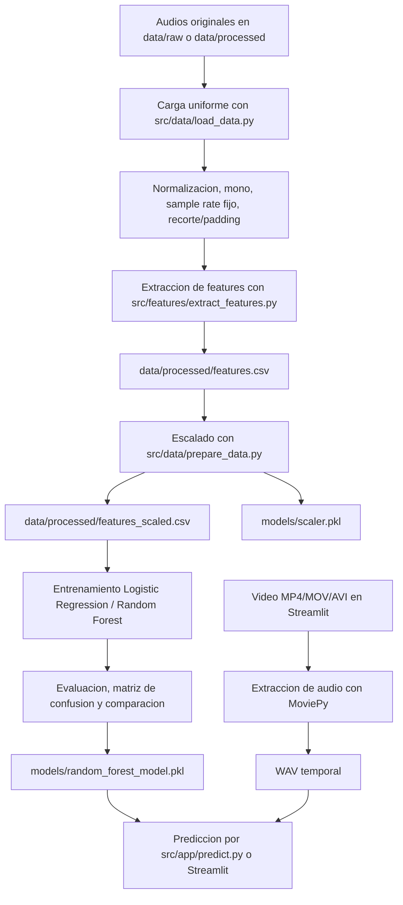

# Documentacion completa - DeteccionDeDisparos

## 1. Resumen del proyecto

**DeteccionDeDisparos** es un sistema de deteccion de disparos basado en analisis acustico y Machine Learning. El proyecto toma archivos de audio, los normaliza, extrae caracteristicas acusticas, entrena modelos de clasificacion binaria y expone una interfaz en Streamlit para analizar archivos de audio o video subidos por el usuario.

La clasificacion principal del sistema tiene dos salidas:

| Label | Clase | Significado |
|---:|---|---|
| 1 | `disparos` | El audio contiene un evento acustico clasificado como disparo. |
| 0 | `no_disparos` | El audio no corresponde a un disparo. |

El objetivo es distinguir eventos de disparo frente a otros sonidos usando caracteristicas extraidas de la senal de audio, como MFCC, energia RMS, Zero Crossing Rate y descriptores espectrales. Cuando la entrada es video, el sistema extrae primero la pista de audio del archivo y luego aplica el mismo flujo acustico de clasificacion.

## 2. Estructura general del repositorio

```text
DeteccionDeDisparos/
├── data/
│   ├── raw/                 # Audios originales esperados, ignorados por git.
│   └── processed/           # Audios procesados y CSVs generados, ignorados por git.
├── docs/
│   ├── README_docs.md
│   ├── documentacion_completa.md
│   └── model_analysis.txt
├── models/
│   ├── random_forest_model.pkl
│   └── scaler.pkl
├── notebooks/
│   └── .gitkeep
├── reports/
│   └── sprint3_report.py
├── src/
│   ├── app/
│   │   ├── predict.py
│   │   └── streamlit_app.py
│   ├── data/
│   │   ├── load_data.py
│   │   ├── prepare_data.py
│   │   ├── preprocess.py
│   │   └── validate_data.py
│   ├── features/
│   │   ├── extract_features.py
│   │   └── visualization.py
│   ├── models/
│   │   ├── compare_models.py
│   │   ├── confusion_matrix_model.py
│   │   ├── evaluate_model.py
│   │   ├── optimize_random_forest.py
│   │   ├── save_model.py
│   │   ├── split_dataset.py
│   │   ├── train_logistic_regression.py
│   │   └── train_random_forest.py
│   └── preprocessing/
│       └── save_processed_audio.py
├── tests/
│   ├── load_data.py
│   ├── python-test.yml
│   ├── test_audio_not_empty.py
│   ├── test_audio_types.py
│   ├── test_base.py
│   └── test_waveform.py
├── main.py
├── README.md
├── requirements.txt
└── .gitignore
```

## 3. Flujo completo del pipeline

El pipeline de entrenamiento es acustico. El flujo principal parte de carpetas con audios organizados por clase, genera un dataset de features, escala esas variables, entrena modelos, guarda el mejor modelo y finalmente permite usarlo desde una app. En inferencia, la app puede recibir audio directamente o video; si recibe video, primero convierte la pista de audio a WAV temporal y despues ejecuta el mismo clasificador.



## 4. Organizacion y trabajo de los datos

### 4.1 Carpetas esperadas

El codigo espera que los audios esten separados por clase en una estructura como esta:

```text
data/raw/
├── disparos/
└── no_disparos/

data/processed/
├── disparos/
└── no_disparos/
```

En el `main.py` actual, la carpeta activa para leer datos es:

```python
carpeta = os.path.join(BASE_DIR, "data", "processed")
```

La linea para usar `data/raw` existe, pero esta comentada. Esto indica que el flujo operativo actual trabaja sobre audios ya procesados o ubicados en `data/processed`.

### 4.2 Archivos de datos versionados

El repositorio no versiona los audios ni los CSV generados. El `.gitignore` excluye:

```text
data/raw/*
data/processed/*
```

Por eso, al clonar el repositorio solo aparece la estructura base y no el dataset completo. Esto es normal para evitar subir archivos pesados o sensibles.

### 4.3 Clases y labels

La funcion `cargar_dataset` define el mapeo de clases:

```python
clases = {
    "disparos": 1,
    "no_disparos": 0
}
```

Cada audio cargado queda representado como un diccionario con:

| Campo | Descripcion |
|---|---|
| `archivo` | Nombre del archivo de audio. |
| `ruta` | Ruta completa del archivo. |
| `audio` | Senal de audio como arreglo de NumPy. |
| `sample_rate` | Frecuencia de muestreo usada por el sistema. |
| `label` | Etiqueta numerica, 1 o 0. |
| `clase` | Nombre de clase, `disparos` o `no_disparos`. |
| `duracion` | Duracion calculada despues del ajuste. |

### 4.4 Formatos soportados

El cargador acepta:

```text
.wav, .mp3, .flac, .ogg
```

La app Streamlit acepta carga de audio y video:

```text
.wav, .mp3, .mp4, .mov, .avi
```

## 5. Preprocesamiento de audio

El preprocesamiento principal esta en `src/data/load_data.py`, dentro de la funcion `cargar_audio`.

Parametros globales:

| Parametro | Valor | Uso |
|---|---:|---|
| `SAMPLE_RATE` | 22050 | Frecuencia de muestreo uniforme. |
| `DURACION_OBJETIVO` | 3 | Duracion fija en segundos. |
| `FORMATOS_VALIDOS` | `.wav`, `.mp3`, `.flac`, `.ogg` | Formatos aceptados por el cargador. |

Pasos aplicados a cada audio:

1. **Lectura con Librosa**: se usa `librosa.load`.
2. **Conversion a mono**: `mono=True`.
3. **Cambio de sample rate**: todos los audios se cargan a 22050 Hz.
4. **Normalizacion de amplitud**: si la amplitud maxima es mayor que 0, la senal se divide entre ese valor para quedar dentro de un rango estable.
5. **Duracion uniforme**: todos los audios terminan con `22050 * 3 = 66150` muestras.
6. **Recorte**: si el audio supera 3 segundos, se corta al inicio hasta llegar a la duracion objetivo.
7. **Padding**: si el audio dura menos de 3 segundos, se rellena con ceros al final.
8. **Salida**: devuelve la senal procesada y el sample rate usado.

Este paso es clave porque los modelos de Machine Learning necesitan entradas consistentes. Sin duracion y sample rate uniformes, las features podrian no ser comparables.

## 6. Guardado de audios procesados

El archivo `src/preprocessing/save_processed_audio.py` contiene `guardar_audio_procesado`.

Funcion:

1. Recibe una senal de audio ya procesada.
2. Convierte el nombre de salida a extension `.wav`.
3. Guarda el archivo dentro de:

```text
data/processed/<clase>/<nombre>.wav
```

4. Crea las carpetas necesarias si no existen.
5. Usa `soundfile.write` para escribir el audio.

En `main.py` existe un bloque comentado que llama a esta funcion para todos los items cargados. Si se descomenta, el sistema puede generar copias procesadas de los audios.

## 7. Extraccion de caracteristicas acusticas

La extraccion se implementa en `src/features/extract_features.py`.

El objetivo es convertir una senal de audio en una fila numerica apta para Machine Learning.

### 7.1 MFCC

Funcion: `extraer_mfcc(audio, sr, n_mfcc=13)`

Extrae 13 coeficientes MFCC y luego calcula el promedio temporal de cada coeficiente.

Columnas generadas:

```text
mfcc_1, mfcc_2, ..., mfcc_13
```

Los MFCC resumen propiedades del timbre y del contenido espectral del sonido. Para un disparo, ayudan a capturar patrones acusticos breves, energeticos y con distribucion de frecuencias distinta a otros sonidos.

### 7.2 Zero Crossing Rate

Funcion: `calcular_zcr(audio)`

Genera:

```text
zcr
```

Mide cuantas veces la senal cruza por cero. Es util para representar cambios rapidos de polaridad en la onda, algo relevante en sonidos impulsivos.

### 7.3 RMS Energy

Funcion: `calcular_rms(audio)`

Genera:

```text
rms
```

Mide la energia promedio del audio. Los disparos suelen presentar picos de energia altos y concentrados.

### 7.4 Features espectrales

Funcion: `calcular_spectral_features(audio, sr)`

Genera:

| Feature | Descripcion |
|---|---|
| `spectral_centroid` | Centro de masa del espectro. Indica si el sonido concentra mas energia en frecuencias bajas o altas. |
| `spectral_bandwidth` | Anchura del espectro. Describe la dispersion de energia alrededor del centroide. |
| `spectral_rolloff` | Frecuencia bajo la cual se concentra una proporcion importante de la energia espectral. |

### 7.5 Vector final de features

El vector completo tiene 18 variables:

```text
mfcc_1
mfcc_2
mfcc_3
mfcc_4
mfcc_5
mfcc_6
mfcc_7
mfcc_8
mfcc_9
mfcc_10
mfcc_11
mfcc_12
mfcc_13
zcr
rms
spectral_centroid
spectral_bandwidth
spectral_rolloff
```

En `main.py`, despues de extraer estas features, se agregan tambien:

```text
archivo, clase, label
```

El resultado se guarda en:

```text
data/processed/features.csv
```

## 8. Preparacion del dataset tabular

El archivo `src/data/prepare_data.py` transforma `features.csv` en `features_scaled.csv`.

Entrada:

```text
data/processed/features.csv
```

Salida:

```text
data/processed/features_scaled.csv
models/scaler.pkl
```

Pasos:

1. Lee `features.csv` con Pandas.
2. Elimina columnas no numericas o no predictivas:

```text
archivo, clase, label
```

3. Separa `X` y `y`.
4. Aplica `StandardScaler` a las features numericas.
5. Vuelve a construir un DataFrame con las features escaladas.
6. Reagrega la columna `label`.
7. Guarda el CSV escalado.
8. Guarda el scaler en `models/scaler.pkl`.

El scaler guardado es fundamental para inferencia: cualquier audio nuevo debe escalarse con el mismo scaler usado durante entrenamiento.

## 9. Validacion del dataset

El archivo `src/data/validate_data.py` revisa `features.csv`.

Valida:

- Informacion general del DataFrame.
- Primeras filas.
- Valores nulos por columna.
- Filas duplicadas.
- Estadisticas descriptivas.
- Lista de columnas.
- Si el archivo esta vacio.
- Si existen columnas numericas.

Si encuentra problemas, los reporta en consola. Si no, indica que el dataset esta listo para continuar.

## 10. Visualizacion

El archivo `src/features/visualization.py` contiene funciones de waveform.

### 10.1 `mostrar_waveform`

Muestra una senal de audio usando `librosa.display.waveshow`.

Incluye:

- Figura de Matplotlib.
- Eje X en segundos.
- Eje Y en amplitud.
- Titulo configurable.

### 10.2 `mostrar_waveforms_por_clase`

Recorre el dataset y muestra una cantidad limitada de audios por clase. Sirve para inspeccion visual y validacion exploratoria.

## 11. Entrenamiento de modelos

Los modelos trabajan con:

```text
data/processed/features_scaled.csv
```

Todos los scripts principales separan:

```python
X = df.drop(columns=["label"])
y = df["label"]
```

Y usan una division:

```python
train_test_split(
    X,
    y,
    test_size=0.2,
    random_state=42,
    stratify=y
)
```

Esto significa:

- 80% del dataset para entrenamiento.
- 20% para prueba.
- Semilla fija para reproducibilidad.
- Division estratificada para conservar la proporcion de clases.

### 11.1 Logistic Regression

Archivo:

```text
src/models/train_logistic_regression.py
```

Modelo:

```python
LogisticRegression(max_iter=1000)
```

Metricas impresas:

- Accuracy.
- Classification report.
- Confusion matrix.

Segun `src/models/compare_models.py`, el resultado registrado para Logistic Regression fue:

| Metrica | Valor |
|---|---:|
| Accuracy | 0.8398 |
| Precision | 0.82 |
| Recall | 0.84 |
| F1-Score | 0.83 |

### 11.2 Random Forest

Archivo:

```text
src/models/train_random_forest.py
```

Modelo base:

```python
RandomForestClassifier(
    n_estimators=100,
    random_state=42
)
```

Metricas impresas:

- Accuracy.
- Classification report.
- Confusion matrix.

Segun `src/models/compare_models.py`, el resultado registrado para Random Forest fue:

| Metrica | Valor |
|---|---:|
| Accuracy | 0.9702 |
| Precision | 0.96 |
| Recall | 0.97 |
| F1-Score | 0.97 |

### 11.3 Optimizacion de Random Forest

Archivo:

```text
src/models/optimize_random_forest.py
```

Usa `GridSearchCV` con validacion cruzada de 3 folds.

Grid de hiperparametros:

```python
param_grid = {
    "n_estimators": [50, 100],
    "max_depth": [10, 20, None],
    "min_samples_split": [2, 5]
}
```

El scoring usado es `accuracy` y `n_jobs=-1` para paralelizar.

### 11.4 Guardado del modelo final

Archivo:

```text
src/models/save_model.py
```

Modelo guardado:

```python
RandomForestClassifier(
    n_estimators=100,
    max_depth=20,
    min_samples_split=2,
    random_state=42
)
```

Salida:

```text
models/random_forest_model.pkl
```

El archivo `models/random_forest_model.pkl` esta versionado en el repositorio y es el modelo usado por la prediccion.

## 12. Evaluacion del modelo

### 12.1 Evaluacion general

Archivo:

```text
src/models/evaluate_model.py
```

Carga:

```text
data/processed/features_scaled.csv
models/random_forest_model.pkl
```

Calcula:

- Accuracy.
- Precision.
- Recall.
- F1-Score.

### 12.2 Matriz de confusion

Archivo:

```text
src/models/confusion_matrix_model.py
```

Carga el modelo guardado y genera una matriz de confusion sobre el split de prueba.

### 12.3 Analisis registrado

El archivo `docs/model_analysis.txt` reporta estos resultados finales:

| Metrica | Valor |
|---|---:|
| Accuracy | 0.9689 |
| Precision | 0.9577 |
| Recall | 0.9763 |
| F1-Score | 0.9669 |

Matriz de confusion:

```text
[[793  31]
 [ 17 701]]
```

Interpretacion:

| Caso | Cantidad |
|---|---:|
| No disparos clasificados correctamente | 793 |
| Disparos detectados correctamente | 701 |
| Falsos positivos | 31 |
| Falsos negativos | 17 |

El reporte concluye que Random Forest fue seleccionado por su mejor rendimiento frente a Logistic Regression.

## 13. Clasificacion desde audio

La clasificacion desde audio se implementa de dos formas:

1. Funcion de prediccion directa en `src/app/predict.py`.
2. Interfaz web en `src/app/streamlit_app.py`.

### 13.1 Prediccion directa con features

Archivo:

```text
src/app/predict.py
```

Funcion:

```python
predict_audio(features)
```

Flujo:

1. Carga `models/random_forest_model.pkl`.
2. Carga `models/scaler.pkl`.
3. Define el orden exacto de las 18 columnas de features.
4. Convierte la lista de features en DataFrame.
5. Escala con el scaler entrenado.
6. Ejecuta `model.predict`.
7. Devuelve:

```text
DISPARO
NO DISPARO
```

Este modulo no carga audio desde archivo; espera recibir directamente el vector de features.

### 13.2 Prediccion desde archivo subido en Streamlit

Archivo:

```text
src/app/streamlit_app.py
```

Funcion principal:

```python
predecir_audio(audio_file)
```

Flujo cuando el archivo subido es audio:

1. Carga el modelo Random Forest.
2. Carga el scaler.
3. Guarda temporalmente el archivo subido por el usuario.
4. Detecta la extension del archivo.
5. Si la extension es `wav` o `mp3`, usa directamente ese archivo temporal como entrada acustica.
6. Extrae features desde ese archivo temporal.
7. Construye un DataFrame con las mismas 18 columnas usadas en entrenamiento.
8. Aplica el scaler.
9. Ejecuta `model.predict`.
10. Ejecuta `model.predict_proba` para obtener confianza.
11. Elimina el archivo temporal.
12. Devuelve resultado y porcentaje de confianza.

Flujo cuando el archivo subido es video:

1. Carga el modelo Random Forest.
2. Carga el scaler.
3. Guarda temporalmente el video subido por el usuario.
4. Detecta la extension del archivo.
5. Si la extension es `mp4`, `mov` o `avi`, llama a `convertir_video_a_audio`.
6. Extrae la pista de audio del video y la guarda como WAV temporal.
7. Extrae las mismas 18 features acusticas desde el WAV temporal.
8. Construye un DataFrame con las mismas 18 columnas usadas en entrenamiento.
9. Aplica el scaler.
10. Ejecuta `model.predict`.
11. Ejecuta `model.predict_proba` para obtener confianza.
12. Elimina el video temporal y el WAV temporal.
13. Devuelve resultado y porcentaje de confianza.

### 13.3 Extraccion de features dentro de la app

La app tiene su propia funcion `extraer_features(audio_path)`.

Extrae:

- 13 MFCC.
- ZCR.
- RMS.
- Spectral centroid.
- Spectral bandwidth.
- Spectral rolloff.

Diferencia importante: en la app, `librosa.load(audio_path, sr=None)` conserva el sample rate original del archivo, mientras que el pipeline de entrenamiento usa `sr=22050` y audio mono. Para maxima consistencia, convendria reutilizar la misma funcion de carga/preprocesamiento de `src/data/load_data.py`.

### 13.4 Respuesta visual en la app

Si el resultado es `DISPARO`, Streamlit muestra un mensaje de alerta y llama a:

```python
mostrar_mapa_con_gps()
```

Si el resultado es `NO DISPARO`, muestra un mensaje de exito indicando que no se detecto disparo.

## 14. Geolocalizacion y mapa

La app Streamlit incluye una funcion de ubicacion basada en GPS del navegador:

| Funcion | Proposito |
|---|---|
| `mostrar_mapa_con_gps` | Inserta HTML/JavaScript con Leaflet y solicita geolocalizacion del navegador. |

En el flujo actual, cuando se detecta un disparo, la app usa `mostrar_mapa_con_gps`, que depende del permiso de ubicacion del navegador. Dentro del HTML insertado se usa Leaflet para mostrar el mapa y Nominatim para obtener una direccion aproximada desde latitud y longitud.

## 15. Clasificacion desde video

La clasificacion desde video ya esta implementada en `src/app/streamlit_app.py`. El enfoque no analiza imagenes ni frames; usa el video como contenedor multimedia, extrae su pista de audio y aplica el mismo clasificador acustico usado para archivos `.wav` y `.mp3`.

### 15.1 Formatos de video aceptados

La interfaz acepta:

```text
.mp4, .mov, .avi
```

Estos formatos se habilitan en el `file_uploader` de Streamlit:

```python
type=["wav", "mp3", "mp4", "mov", "avi"]
```

### 15.2 Funcion de conversion de video a audio

La conversion se realiza con:

```python
convertir_video_a_audio(video_path)
```

Flujo interno:

1. Construye una ruta de salida agregando `.wav` al nombre temporal del video.
2. Abre el archivo con `VideoFileClip(video_path)`.
3. Verifica si el video tiene pista de audio.
4. Si `video.audio is None`, cierra el video y lanza `ValueError("El video no tiene audio.")`.
5. Si hay audio, escribe un WAV temporal con:

```python
video.audio.write_audiofile(
    audio_path,
    codec="pcm_s16le",
    logger=None
)
```

6. Cierra el objeto de video.
7. Devuelve la ruta del WAV generado.

### 15.3 Flujo de clasificacion desde video

Cuando el usuario sube un video:

1. Streamlit guarda el archivo subido en un archivo temporal con su extension original.
2. `predecir_audio` identifica la extension con:

```python
extension = uploaded_file.name.split(".")[-1].lower()
```

3. Si la extension esta en `["mp4", "mov", "avi"]`, llama a `convertir_video_a_audio`.
4. La pista de audio queda disponible como WAV temporal.
5. `extraer_features` carga ese WAV con Librosa.
6. Se calculan las 18 features acusticas: 13 MFCC, ZCR, RMS, spectral centroid, spectral bandwidth y spectral rolloff.
7. Las features se organizan en un DataFrame con `FEATURE_COLUMNS`.
8. Se escalan con `models/scaler.pkl`.
9. Se clasifican con `models/random_forest_model.pkl`.
10. Se obtiene la confianza con `model.predict_proba`.
11. Se eliminan los temporales: video original y WAV extraido.
12. La app devuelve `DISPARO` o `NO DISPARO`.

### 15.4 Manejo de errores en video

La app contempla dos casos:

- Si el video no contiene audio, muestra el mensaje del `ValueError`.
- Si ocurre otro error durante el analisis, muestra un mensaje general: `Ocurrio un error al analizar el archivo`.

### 15.5 Alcance real del video

La clasificacion desde video es una clasificacion acustica aplicada a la pista de audio del video. No hay deteccion visual de armas, fogonazos, personas, escenas, frames ni objetos. El video se usa para obtener sonido; la decision final sigue dependiendo del modelo Random Forest entrenado con features de audio.

## 16. Aplicacion Streamlit

Archivo:

```text
src/app/streamlit_app.py
```

### 16.1 Proposito

Crear una interfaz para subir un audio o video, ejecutar inferencia acustica y mostrar el resultado de clasificacion.

### 16.2 Configuracion visual

La app define:

```python
st.set_page_config(
    page_title="AcousticForensics ML",
    page_icon="🎧",
    layout="wide"
)
```

Tambien inyecta CSS personalizado para:

- Fondo oscuro.
- Sidebar.
- Tarjetas.
- Zona de subida de audio o video.
- Indicadores de alerta y resultado.

### 16.3 Controles principales

La interfaz contiene:

- Sidebar con botones de navegacion visual.
- Encabezado "Terminal de Analisis Acustico".
- Zona de carga de archivo.
- Reproductor de audio para `.wav` y `.mp3`.
- Reproductor de video para `.mp4`, `.mov` y `.avi`.
- Boton "Analizar archivo".
- Panel lateral de detecciones y telemetria.

### 16.4 Tipos de archivo aceptados

```python
type=["wav", "mp3", "mp4", "mov", "avi"]
```

### 16.5 Ejecucion local

Desde la raiz del proyecto:

```bash
streamlit run src/app/streamlit_app.py
```

## 17. Scripts principales y orden recomendado de ejecucion

Para reconstruir el pipeline completo desde audios disponibles:

### 17.1 Instalar dependencias

```bash
pip install -r requirements.txt
```

### 17.2 Ubicar audios

Colocar audios en:

```text
data/raw/disparos/
data/raw/no_disparos/
```

O, segun el flujo actual del `main.py`:

```text
data/processed/disparos/
data/processed/no_disparos/
```

### 17.3 Generar features

```bash
python main.py
```

Salida esperada:

```text
data/processed/features.csv
```

### 17.4 Validar features

```bash
python src/data/validate_data.py
```

### 17.5 Escalar dataset

```bash
python src/data/prepare_data.py
```

Salidas esperadas:

```text
data/processed/features_scaled.csv
models/scaler.pkl
```

### 17.6 Revisar split

```bash
python src/models/split_dataset.py
```

### 17.7 Entrenar modelos

Logistic Regression:

```bash
python src/models/train_logistic_regression.py
```

Random Forest:

```bash
python src/models/train_random_forest.py
```

### 17.8 Optimizar Random Forest

```bash
python src/models/optimize_random_forest.py
```

### 17.9 Guardar modelo final

```bash
python src/models/save_model.py
```

Salida:

```text
models/random_forest_model.pkl
```

### 17.10 Evaluar modelo

```bash
python src/models/evaluate_model.py
python src/models/confusion_matrix_model.py
python src/models/compare_models.py
```

### 17.11 Ejecutar app

```bash
streamlit run src/app/streamlit_app.py
```

## 18. Documentacion de requirements.txt

El archivo `requirements.txt` contiene:

| Dependencia | Uso dentro del proyecto |
|---|---|
| `numpy` | Manejo de arreglos numericos, audio como arrays, normalizacion y padding. |
| `pandas` | Lectura/escritura de CSVs, manejo de DataFrames de features. |
| `matplotlib` | Visualizacion de waveforms. |
| `librosa` | Carga de audio, resampling, MFCC, ZCR, RMS y features espectrales. |
| `scikit-learn` | Modelos, train/test split, escalado, metricas, GridSearchCV. |
| `jupyter` | Experimentacion en notebooks. |
| `streamlit` | Interfaz web para carga y clasificacion de audio y video. |
| `joblib` | Guardado y carga de modelo y scaler. |
| `pytest` | Pruebas automatizadas. |
| `soundfile` | Guardado de audios procesados en `.wav`. |
| `streamlit-folium` | Integracion potencial de mapas Folium con Streamlit. |
| `streamlit-js-eval` | Evaluacion JavaScript en Streamlit, util para integraciones de navegador. |
| `folium` | Creacion de mapas y marcadores. |
| `moviepy` | Lectura de videos y extraccion de la pista de audio a WAV temporal para clasificacion acustica. |

Observaciones:

- La app usa tambien `requests`, pero `requests` no aparece en `requirements.txt`.
- La app usa mapas con Leaflet desde HTML externo.
- La clasificacion de video depende de `moviepy`. No usa OpenCV ni analisis visual de frames.

## 19. Pruebas automatizadas

La carpeta `tests/` contiene pruebas para verificar carga, tipos y visualizacion.

### 19.1 `tests/load_data.py`

Valida que:

- El dataset no este vacio.
- Cada audio no sea `None`.
- El sample rate sea `SAMPLE_RATE`.
- La longitud sea `SAMPLE_RATE * DURACION_OBJETIVO`.
- El label sea 0 o 1.
- La clase sea `disparos` o `no_disparos`.

### 19.2 `tests/test_waveform.py`

Carga el dataset desde `data/raw`, toma el primer audio y llama a `mostrar_waveform`.

### 19.3 `tests/test_audio_not_empty.py`

Pretende validar que los audios no esten vacios.

Observacion tecnica: el archivo contiene una llamada invalida:

```python
dataset = cargar_dataset(./src/data)
```

La ruta deberia ser un string o una variable, por ejemplo:

```python
dataset = cargar_dataset("data/raw")
```

Tambien falta importar `cargar_dataset`.

### 19.4 `tests/test_audio_types.py`

Pretende validar tipos de datos:

- `audio` como `np.ndarray`.
- `sample_rate` como `int`.
- `clase` como `str`.

Observacion tecnica: tambien usa `cargar_dataset(./src/data)` sin comillas y no importa `cargar_dataset`.

### 19.5 GitHub Actions

El archivo `tests/python-test.yml` define un workflow de GitHub Actions:

```yaml
on:
  push:
    branches: [ "main", "master" ]
  pull_request:
    branches: [ "main", "master" ]
```

Pasos:

1. Checkout.
2. Setup de Python.
3. Instalacion de dependencias.
4. Ejecucion de `pytest -v`.

Observacion: el archivo esta dentro de `tests/`. Para que GitHub Actions lo ejecute automaticamente, normalmente deberia ubicarse en:

```text
.github/workflows/python-test.yml
```

## 20. Archivos del proyecto

### 20.1 `main.py`

Script principal para:

1. Cargar audios.
2. Mostrar informacion de los primeros registros.
3. Extraer features.
4. Guardar `features.csv`.
5. Opcionalmente guardar audios procesados.
6. Opcionalmente analizar duraciones.
7. Opcionalmente mostrar waveforms.

### 20.2 `src/data/load_data.py`

Modulo central de carga uniforme de audio. Define los parametros de sample rate, duracion objetivo, formatos soportados y funciones de carga.

### 20.3 `src/data/preprocess.py`

Archivo presente pero vacio. No contiene logica implementada.

### 20.4 `src/data/prepare_data.py`

Prepara el dataset tabular para entrenamiento, escala features y guarda scaler.

### 20.5 `src/data/validate_data.py`

Valida calidad basica de `features.csv`.

### 20.6 `src/preprocessing/save_processed_audio.py`

Guarda senales procesadas como `.wav` en `data/processed`.

### 20.7 `src/features/extract_features.py`

Extrae las 18 features acusticas usadas por los modelos.

### 20.8 `src/features/visualization.py`

Contiene visualizaciones de waveform.

### 20.9 `src/models/split_dataset.py`

Verifica dimensiones de entrenamiento/prueba.

### 20.10 `src/models/train_logistic_regression.py`

Entrena y evalua Logistic Regression.

### 20.11 `src/models/train_random_forest.py`

Entrena y evalua Random Forest base.

### 20.12 `src/models/optimize_random_forest.py`

Busca hiperparametros de Random Forest con GridSearchCV.

### 20.13 `src/models/save_model.py`

Entrena Random Forest con hiperparametros finales y guarda el modelo.

### 20.14 `src/models/evaluate_model.py`

Evalua el modelo guardado con metricas principales.

### 20.15 `src/models/confusion_matrix_model.py`

Genera matriz de confusion del modelo guardado.

### 20.16 `src/models/compare_models.py`

Compara resultados registrados de Logistic Regression y Random Forest.

### 20.17 `src/models/train_model.py`

Archivo presente pero vacio. No contiene logica implementada.

### 20.18 `src/app/predict.py`

Predice una clase desde un vector de features ya calculado.

### 20.19 `src/app/streamlit_app.py`

App web para subir audio o video, extraer la pista de audio cuando corresponde, calcular features, escalar, predecir, mostrar confianza y activar mapa GPS si detecta disparo.

### 20.20 `reports/sprint3_report.py`

Archivo presente pero vacio.

### 20.21 `notebooks/`

Contiene `.gitkeep`. No hay notebooks versionados en el estado actual.

## 21. Artefactos del modelo

La carpeta `models/` contiene:

| Archivo | Descripcion |
|---|---|
| `random_forest_model.pkl` | Modelo Random Forest serializado con Joblib. |
| `scaler.pkl` | StandardScaler serializado con Joblib. |

Por seguridad, no es recomendable cargar archivos `.pkl` de origen no confiable, ya que pueden ejecutar codigo al deserializarse. En este proyecto se asume que son artefactos propios del repositorio.

## 22. Riesgos, inconsistencias y mejoras recomendadas

### 22.1 Consistencia entre entrenamiento e inferencia

El entrenamiento usa `librosa.load(..., sr=22050, mono=True)` desde `load_data.py`.

La app usa `librosa.load(audio_path, sr=None)`, conservando el sample rate original.

Recomendacion: reutilizar el mismo preprocesamiento del entrenamiento en la app para evitar diferencias entre entrenamiento e inferencia.

### 22.2 Dependencia faltante

`streamlit_app.py` importa `requests`, pero `requirements.txt` no lo incluye.

Recomendacion:

```text
requests
```

### 22.3 Pruebas con errores de sintaxis/importacion

`test_audio_not_empty.py` y `test_audio_types.py` usan rutas sin comillas y no importan `cargar_dataset`.

Recomendacion: corregir imports y rutas antes de ejecutar CI.

### 22.4 Workflow de GitHub Actions

El workflow esta en `tests/python-test.yml`.

Recomendacion: moverlo a:

```text
.github/workflows/python-test.yml
```

### 22.5 Archivos vacios

Existen archivos sin implementacion:

- `src/data/preprocess.py`
- `src/models/train_model.py`
- `reports/sprint3_report.py`
- `tests/test_base.py`
- `docs/README_docs.md` antes de esta documentacion.

Recomendacion: completar o eliminar archivos vacios segun su proposito.

### 22.6 Datos no versionados

El dataset no esta incluido por `.gitignore`.

Recomendacion: documentar fuente, tamano, criterio de recoleccion, balance de clases y version del dataset en un archivo separado, por ejemplo `docs/dataset.md`, si se requiere trazabilidad academica o productiva.

### 22.7 Alcance de la clasificacion de video

El video ya se puede clasificar desde la app, pero la clasificacion se basa en la pista de audio extraida con MoviePy. No existe analisis visual de frames ni deteccion por imagen.

Mejoras posibles:

- Dividir videos largos en ventanas temporales para detectar en que segundo ocurre el disparo.
- Reportar timestamps de deteccion.
- Mostrar el fragmento de video asociado a cada alerta.
- Unificar el preprocesamiento de audio extraido desde video con `src/data/load_data.py`.
- Agregar pruebas automatizadas para videos con audio, videos sin audio y formatos no soportados.

## 23. Estado actual del proyecto

Implementado:

- Carga uniforme de audio.
- Normalizacion y duracion fija.
- Extraccion de features acusticas.
- Generacion de `features.csv`.
- Escalado de features.
- Entrenamiento con Logistic Regression y Random Forest.
- Optimizacion de Random Forest.
- Guardado de modelo y scaler.
- Evaluacion con metricas y matriz de confusion.
- App Streamlit para clasificacion de audio y video.
- Extraccion de audio desde video con MoviePy.
- Mapa GPS al detectar disparo.

Parcial o pendiente:

- Deteccion visual sobre frames de video.
- Timestamps de deteccion dentro de videos largos.
- Tests corregidos y ejecutables de forma limpia.
- Workflow CI ubicado en `.github/workflows`.
- Unificacion de preprocesamiento entre entrenamiento y app.
- Documentacion externa del origen del dataset.
- Reportes generados automaticamente.

## 24. Resumen operativo

El proyecto funciona como un clasificador acustico binario:

1. Los audios se organizan por carpetas de clase.
2. Se cargan de forma uniforme a mono, 22050 Hz y 3 segundos.
3. Se normaliza la amplitud.
4. Se extraen 18 caracteristicas acusticas.
5. Se genera un CSV de features.
6. Se escalan las features.
7. Se entrenan modelos supervisados.
8. Random Forest queda como modelo principal.
9. El modelo y el scaler se guardan en `models/`.
10. La app permite subir audio o video.
11. Si el archivo es video, extrae su pista de audio a WAV temporal con MoviePy.
12. La app extrae features, escala, predice y muestra resultado.

El sistema disponible clasifica audio directamente y tambien clasifica videos a partir de su pista de audio.
