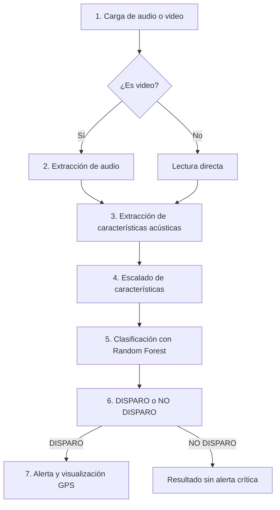

# Documentación Completa - SAPO AI

**SAPO AI** es el **Sistema Acústico de Protección y Observación**. El proyecto implementa una aplicación de inteligencia artificial para clasificación acústica de disparos a partir de archivos de audio y video.

La salida del sistema es binaria:

| Resultado | Significado |
|---|---|
| DISPARO | El contenido acústico fue clasificado como disparo. |
| NO DISPARO | El contenido acústico no fue clasificado como disparo. |

Cuando el resultado es **DISPARO**, la aplicación muestra una alerta y solicita ubicación GPS para visualizar un mapa aproximado del punto de detección.

## Objetivo

Desarrollar un sistema de clasificación acústica que identifique eventos asociados a disparos mediante procesamiento digital de señales, extracción de características y un modelo Random Forest.

## Problema abordado

La detección manual de disparos en grabaciones puede ser lenta y poco escalable. SAPO AI automatiza la revisión inicial del contenido acústico, ofrece una clasificación clara y permite activar una visualización geoespacial cuando se detecta un evento crítico.

## Tecnologías utilizadas

- Python
- Streamlit
- Librosa
- MoviePy
- NumPy
- Pandas
- Scikit-learn
- Joblib
- Matplotlib
- Folium, Leaflet y OpenStreetMap
- Pytest

## Estructura del repositorio

```text
DeteccionDeDisparos/
├── data/
│   ├── raw/
│   ├── processed/
│   └── videos IA/
├── docs/
├── models/
├── notebooks/
├── reports/
├── src/
│   ├── app/
│   ├── data/
│   ├── features/
│   ├── models/
│   └── preprocessing/
├── tests/
├── main.py
├── requirements.txt
└── README.md
```

## Pipeline del sistema



### 1. Carga de audio o video

La app Streamlit acepta archivos en los formatos:

- WAV
- MP3
- MP4
- MOV
- AVI

### 2. Extracción de audio si el archivo es video

Si el archivo cargado es `mp4`, `mov` o `avi`, SAPO AI utiliza MoviePy para extraer la pista de audio y convertirla en un WAV temporal.

### 3. Extracción de características acústicas

El sistema calcula 18 características:

- 13 coeficientes MFCC.
- Zero Crossing Rate.
- RMS Energy.
- Spectral Centroid.
- Spectral Bandwidth.
- Spectral Rolloff.

Estas variables representan propiedades tímbricas, energéticas y espectrales del audio.

### 4. Escalado de características

Las características se transforman mediante el scaler asociado al modelo. En la app actual se usa:

```text
models/sapo_scaler.pkl
```

### 5. Clasificación con Random Forest

El modelo actual es:

```text
models/sapo.pkl
```

SAPO clasifica el vector acústico escalado como **DISPARO** o **NO DISPARO**.

### 6. Resultado

La app muestra el resultado y una confianza aproximada basada en las probabilidades del modelo.

### 7. Alerta y visualización GPS

Si se detecta un disparo, la app solicita permiso de ubicación al navegador y muestra un mapa mediante Leaflet y OpenStreetMap.

## Modelo SAPO

**SAPO** es el modelo actual del proyecto. Está basado en Random Forest y se utiliza como clasificador binario para distinguir entre audios de disparos y audios que no corresponden a disparos.

Artefactos:

```text
models/sapo.pkl
models/sapo_scaler.pkl
```

## Modelo Sapito

**Sapito** es la versión anterior del modelo. Se conserva como referencia histórica del proceso de evolución del sistema.

Artefactos:

```text
models/sapito.pkl
models/sapito_scaler.pkl
```

## Clasificación y predicción

**Clasificación** es la tarea general que resuelve SAPO AI: asignar cada archivo a una clase. En este caso, las clases son **DISPARO** y **NO DISPARO**.

**Predicción** es la ejecución concreta del modelo sobre un archivo nuevo. Cada vez que el usuario analiza un archivo, SAPO AI realiza una predicción dentro de un problema de clasificación binaria.

## Métricas del modelo actual

El modelo SAPO tiene un accuracy aproximado de **97%**. La evaluación documentada reporta:

| Métrica | Valor |
|---|---:|
| Accuracy | 96.89% |
| Precision | 95.77% |
| Recall | 97.63% |
| F1-Score | 96.69% |

Matriz de confusión:

```text
[[793  31]
 [ 17 701]]
```

Interpretación:

- 793 audios **NO DISPARO** clasificados correctamente.
- 701 audios **DISPARO** detectados correctamente.
- 31 falsos positivos.
- 17 falsos negativos.

## Revisión de overfitting

| Indicador | Valor |
|---|---:|
| Train Accuracy | 99.89% |
| Test Accuracy | 96.89% |
| Diferencia | 3% |
| Cross Validation media | 97.15% |

La diferencia entre train y test es cercana al 3%, y la validación cruzada mantiene una media aproximada de 97.15%. La conclusión documentada es que **no se observa overfitting fuerte**.

## Entrenamiento limpio sin data leakage

El script:

```text
src/models/train_random_forest_clean.py
```

entrena un modelo Random Forest evitando fuga de datos. Primero divide el dataset en entrenamiento y prueba; luego ajusta el scaler únicamente sobre el conjunto de entrenamiento y transforma el conjunto de prueba con ese mismo scaler.

## Instalación

macOS o Linux:

```bash
python3 -m venv venv
source venv/bin/activate
pip install -r requirements.txt
```

Windows:

```bash
python -m venv venv
venv\Scripts\activate
pip install -r requirements.txt
```

## Ejecución de la app

```bash
streamlit run src/app/streamlit_app.py
```

## Generación de features

```bash
python main.py
```

El script espera datos organizados en:

```text
data/processed/
├── disparos/
└── no_disparos/
```

Salida:

```text
data/processed/features.csv
```

## Entrenar el modelo limpio

```bash
python src/models/train_random_forest_clean.py
```

## Evaluar overfitting

```bash
python src/models/check_overfitting.py
```

## Uso de la aplicación

1. Activar el entorno virtual.
2. Ejecutar Streamlit.
3. Subir un archivo WAV, MP3, MP4, MOV o AVI.
4. Presionar **Analizar con SAPO**.
5. Revisar el resultado.
6. Si el resultado es **DISPARO**, aceptar o rechazar la solicitud de ubicación GPS.

## Limitaciones actuales

- El rendimiento depende de la calidad y representatividad del dataset.
- La app analiza audio; si la entrada es video, solo usa la pista acústica.
- El mapa depende de permisos del navegador y servicios externos.
- Puede haber degradación con ruido extremo, saturación o grabaciones de baja calidad.
- El resultado debe entenderse como apoyo de clasificación, no como evidencia forense concluyente.

## Mejoras futuras

- **SAPO Vision:** análisis visual de video.
- **SAPO Fusion:** integración de evidencia acústica y visual.
- Historial de detecciones.
- Mejor integración de mapas.
- Despliegue web.
- Evaluación con más datos y escenarios reales.

## Autor

**Levanx**
