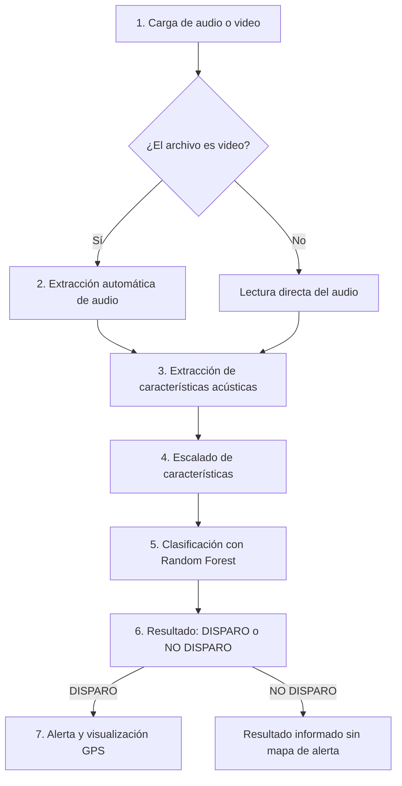

# Pipeline de SAPO AI

SAPO AI implementa un pipeline de clasificación acústica. El flujo inicia con un archivo de audio o video y finaliza con una etiqueta binaria: **DISPARO** o **NO DISPARO**.

## Flujo general



## 1. Carga de audio o video

La aplicación permite subir archivos desde la interfaz Streamlit. Los formatos soportados por la app son:

- WAV
- MP3
- MP4
- MOV
- AVI

El archivo se guarda temporalmente para ser procesado.

## 2. Extracción de audio si el archivo es video

Cuando la extensión corresponde a `mp4`, `mov` o `avi`, SAPO AI utiliza MoviePy para abrir el video y extraer la pista de audio a un archivo WAV temporal. Si el video no contiene audio, el sistema informa el error.

Archivo relacionado:

```text
src/app/streamlit_app.py
```

Función principal:

```text
convertir_video_a_audio(video_path)
```

## 3. Extracción de características acústicas

SAPO AI transforma la señal acústica en variables numéricas. Las características utilizadas son:

| Característica | Descripción |
|---|---|
| MFCC 1-13 | Coeficientes cepstrales que resumen el timbre y la forma espectral del sonido. |
| ZCR | Tasa de cruces por cero; útil para sonidos impulsivos y transitorios. |
| RMS | Energía promedio de la señal. |
| Spectral Centroid | Centro de masa del espectro. |
| Spectral Bandwidth | Dispersión de la energía espectral. |
| Spectral Rolloff | Frecuencia bajo la cual se concentra una proporción alta de la energía. |

Archivo relacionado:

```text
src/features/extract_features.py
```

## 4. Escalado de características

Antes de clasificar, las características se transforman con el escalador asociado al modelo. En la app actual se cargan:

```text
models/sapo_scaler.pkl
```

El entrenamiento limpio usa `StandardScaler` ajustado únicamente sobre los datos de entrenamiento. Esto evita que información del conjunto de prueba influya en el preprocesamiento.

## 5. Clasificación con Random Forest

Las características escaladas se envían al modelo actual:

```text
models/sapo.pkl
```

El modelo SAPO utiliza Random Forest para resolver una tarea de clasificación binaria.

## 6. Resultado: DISPARO o NO DISPARO

El resultado final se expresa en lenguaje claro:

| Salida | Significado |
|---|---|
| DISPARO | El contenido acústico fue clasificado como disparo. |
| NO DISPARO | El contenido acústico no fue clasificado como disparo. |

La app también calcula una confianza aproximada a partir de `predict_proba`.

## 7. Alerta y visualización GPS

Si el resultado es **DISPARO**, SAPO AI:

1. Muestra una alerta visual.
2. Solicita permiso de ubicación al navegador.
3. Visualiza un mapa con Leaflet y OpenStreetMap.
4. Intenta obtener una dirección aproximada mediante geocodificación inversa.

Esta ubicación depende del permiso del usuario, del navegador y de los servicios externos utilizados.
